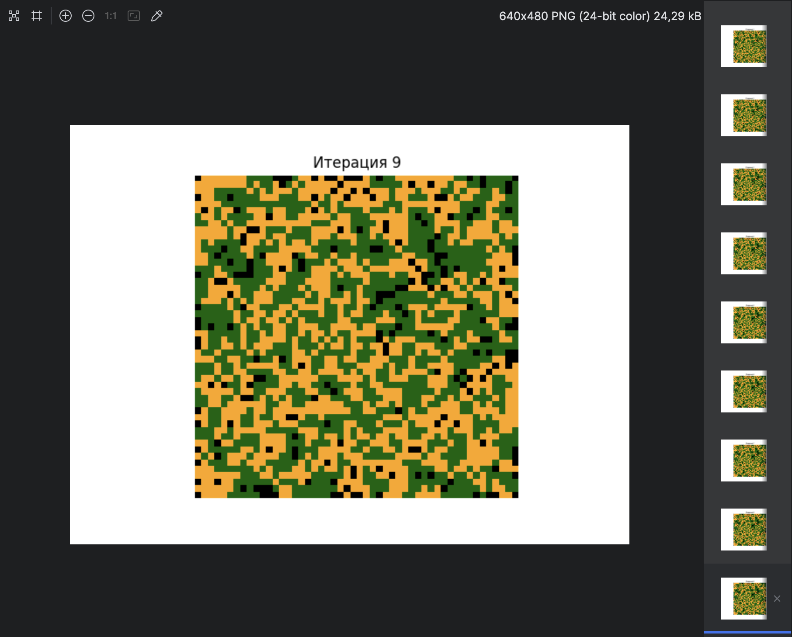

Этот код представляет собой симуляцию модели Агентов Сегрегации (Schelling's Segregation Model), где агенты (в данном случае зеленые и желтые) взаимодействуют на сетке, с целью проверить, могут ли они жить рядом друг с другом, и как это влияет на их перемещения.

---

## Описание

Этот код моделирует поведение агентов, распределённых по сетке, где каждый агент может быть одного из двух типов (зеленый или желтый), или клетка может быть пустой. Моделируется поведение агентов в зависимости от их предпочтений относительно соседей — агенты предпочитают быть рядом с похожими агентами. В случае неудовлетворенности своим расположением, агент может переместиться в случайную пустую клетку. Процесс повторяется на нескольких итерациях, и изменения в расположении агентов визуализируются на каждом шаге.

### Параметры системы:
- **GRID_SIZE** — размер сетки (50x50).
- **PROB_GREEN** — вероятность того, что клетка будет занята зеленым агентом (45%).
- **PROB_YELLOW** — вероятность того, что клетка будет занята желтым агентом (45%).
- **PROB_EMPTY** — вероятность того, что клетка будет пустой (10%).
- **ITERATIONS** — количество итераций (шагов), в течение которых будет выполняться симуляция (10).

### Основные функции:

1. **create_environment(size, prob_green, prob_yellow, prob_empty)**:
   - Эта функция генерирует начальную сетку размером `size` x `size`, где каждая клетка может быть пустой (0), содержать зеленого агента (1) или желтого агента (2), в соответствии с заданными вероятностями.
   
2. **satisfies_preference(matrix, row, col)**:
   - Проверяет, удовлетворен ли агент в данной клетке. Агент удовлетворен, если рядом с ним находится как минимум 2 других агента того же типа. Если клетка пуста, агент считается удовлетворенным.
   
3. **relocate_individuals(matrix)**:
   - Перемещает неудовлетворенных агентов в случайные пустые клетки. Для этого выбираются агенты, которые не удовлетворены своим окружением, и перемещаются в пустую клетку. Сначала перемешиваются неудовлетворенные агенты, чтобы увеличить разнообразие перемещений.
   
4. **display_grid(matrix, iteration)**:
   - Функция для визуализации состояния сетки на каждом шаге симуляции. Каждая клетка отображается в определенном цвете в зависимости от того, что она содержит:
     - Черный цвет — пустая клетка (0)
     - Темно-зеленый — зеленый агент (1)
     - Оранжевый — желтый агент (2)
   
5. **run_simulation(steps)**:
   - Основной цикл симуляции. Он инициализирует начальную сетку и выполняет заданное количество итераций, обновляя состояние сетки и визуализируя изменения на каждом шаге.

### Процесс выполнения:
- Сначала создается начальная сетка с заданной вероятностью для зеленых агентов, желтых агентов и пустых клеток.
- Затем в каждой итерации проверяется состояние каждого агента: удовлетворен ли он своими соседями. Если нет — агент перемещается в случайную пустую клетку.
- Результаты отображаются на графиках, которые обновляются на каждом шаге, показывая распределение агентов на сетке.

### Как запустить:
Для запуска симуляции необходимо просто вызвать функцию `run_simulation(ITERATIONS)`. Количество итераций можно изменять, изменяя параметр `ITERATIONS`.

### Зависимости:
Для работы этого кода требуются следующие Python библиотеки:
- `numpy` — для работы с массивами и матрицами.
- `matplotlib` — для визуализации результатов симуляции.

---

## Пример визуализации

Пример работы симуляции будет выглядеть как серию изображений, на которых показано состояние сетки после каждого шага. Зеленые и желтые клетки будут представлять агентов, а черные — пустые клетки.

# Schelling-s-Segregation-Model
